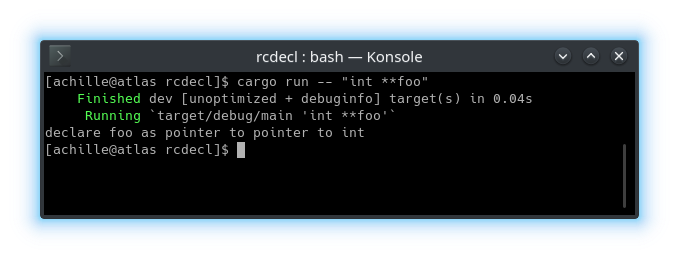
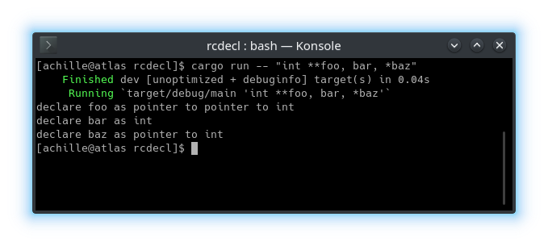
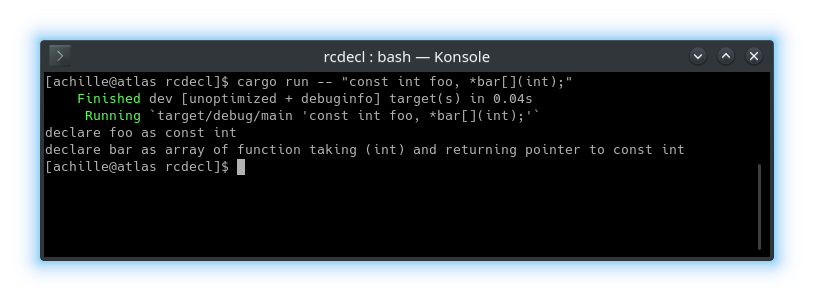

# rcdecl

A tool to help you understand confusing c99 declarations.

## NOTE

This software is very much a work in progress, at the moment it doesn't support declarations that contain typedefs, structs, unions, or enums, and will panic if you give it a declaration containing any of them.

Additionally, it will accept syntactically legal but semanticaly illegal declarations like `int foo()[];`, which is considered illegal, as functions can not return arrays, only pointers to arrays.

## Usage

Pass the declaration to be parsed as a command line argument to the program. The trailing semicolon is optional. Additionally, you may need to wrap the declaration with quotation marks.

### Examples



When a declaration defines multiple variables, each definition will be printed on a seperate line.



## How it works

This uses the [Right-Left Rule](https://cseweb.ucsd.edu/~ricko/rt_lt.rule.html) to parse c declarations.

To summarize:

A declaration is broken into 2 parts, a list of declration specifiers (storage class, type specifier, type qualifier, and function specifier), and an optional list of declarators (each with an optional initializer). The declarations specifiers will apply to each declarator in the list.

For example, the declaration `const int foo, *bar[](int);` would be be broken up into
```
           init-declarator-list
            vvvvvvvvvvvvvvvv
const int   foo, *bar[](int);
^^^^^^^^^
specifiers
```

To determine the type of each variable in this declaration, you have to apply the right-left rule to each declarator in the init-declarator-list.

To determine type of the second definition, `*bar[](int)`, we will create 2 stacks, one to hold the declarator parts that appear to the left of the identifier (bar), and one to hold the ones that appear to the right.

First, the type specifiers from the specifier-list will be pushed onto the left stack.

```
  declarator: "*bar[]()"

   const int
  __________    ___________
     left          right   
```

Then we will continue pushing elements onto the left stack until we reach the identifier.

```
  declarator: "bar[](int)"

       *
   const int
  __________    ___________
     left          right   
```

After we have consumed the identifier, we will push the remaining elements onto the right stack.

```
  declarator: ""

       *          fn(int)
   const int        []
  __________    ___________
     left          right   
```

Finally, the two stacks are merged by popping the elements from the left stack and pushing them onto the right stack.

```
  declarator: ""

                 const int
                     *
                  fn(int)
                     []
  __________    ___________
     left          right   
```

Now that we have merged the stacks, we can build the final type from the inside out. In this case, the final type would be an array of functions (taking a single int as an argument) that returns a pointer to a const int.

Nested declarators (that is, declarators that have other declarators inside of them surrounded by parentheses) can be handled by recursively performing the same steps as above and popping each element on the resulting stack and pusing it onto the current active stack.



This is built on top of a c compiler I am working on, whos source can be found [here](https://github.com/aHeraud/cc/) (it's pretty ugly and doesn't do anything yet though).